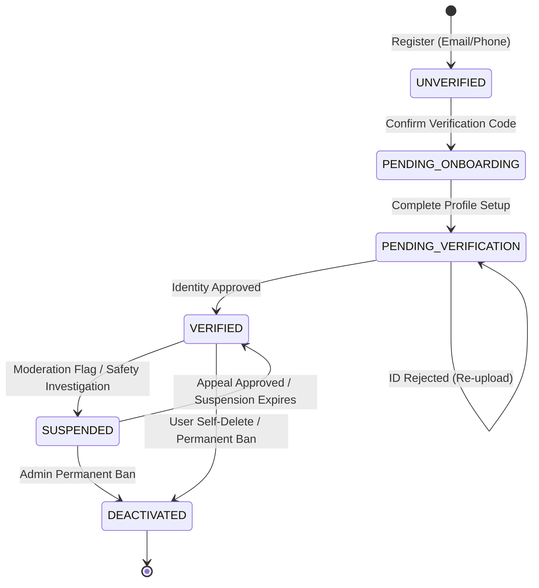
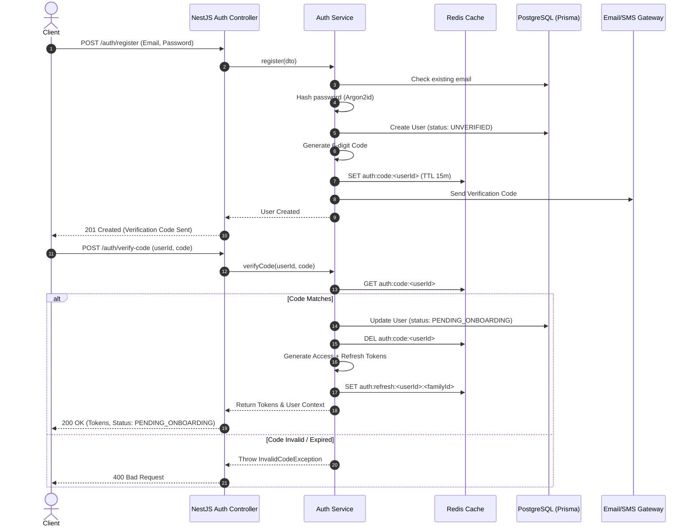
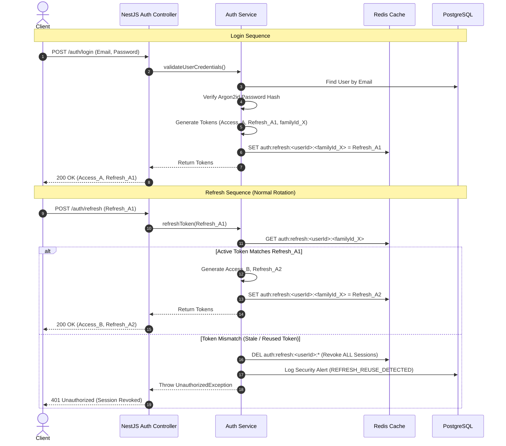

# Chapter One — Authentication System Design Document

**Document Version:** 1.0.0  
**Status:** Approved Architecture Draft  
**Target Audience:** Backend Engineers, Security Auditors, Client Developers  

---

## 1. Authentication Goals

The Chapter One authentication system provides a secure, stateless, and scalable foundation for the platform's relationship-first dating experience. The core design goals are:

1. **High Security & Threat Resilience:** Protect user credentials, tokens, and session integrity against common web/mobile attack vectors including brute-force attempts, token theft, replay attacks, credential stuffing, and session hijacking.
2. **Stateless Scalability with Controlled Revocation:** Utilize short-lived JWT access tokens for low-latency API verification while enforcing immediate session revocation capabilities via Redis-backed refresh token whitelisting/blacklisting.
3. **Cross-Platform Compatibility:** Provide seamless authentication mechanisms for both the React Native (Expo) mobile application (using SecureStore & Bearer Tokens) and the Next.js web application (using HttpOnly, Secure, SameSite cookies or Bearer Authorization headers).
4. **Lifecycle & Verification Integration:** Enforce user lifecycle state checks (e.g. `UNVERIFIED` -> `PENDING_ONBOARDING` -> `VERIFIED`) directly within the authentication middleware/guards to guarantee that users satisfy identity verification requirements before accessing matching or interaction features.
5. **Zero Friction Session Persistence:** Support automatic background token refresh via Refresh Token Rotation (RTR) to keep legitimate users logged in securely without forced re-authentications.

---

## 2. User Lifecycle

A user's state governs their access across the application. The system transitions users across distinct states in a strict lifecycle state machine.

### 2.1 State Definitions

| State | Description | Permitted Actions |
| :--- | :--- | :--- |
| `UNVERIFIED` | Account created via email/phone, but email/SMS verification code has not been confirmed. | Resend verification code, confirm code. |
| `PENDING_ONBOARDING` | Contact verified, but initial profile setup (name, age, gender, location, initial photos) is incomplete. | Complete onboarding steps, upload initial avatar. |
| `PENDING_VERIFICATION` | Profile completed, but mandatory Government ID / AI identity verification is under review. | View verification status, re-upload ID if rejected. |
| `VERIFIED` | Fully verified user active in the system. | Receive introductions, engage in icebreakers, chat, update profile. |
| `SUSPENDED` | Temporarily restricted due to safety reports or policy violations under admin review. | Read moderation notices, submit appeal. |
| `DEACTIVATED` | Account self-deactivated or permanently banned for severe safety breaches. | None (Tokens immediately invalidated). |

### 2.2 Lifecycle State Diagram



---

## 3. Authentication Flow

### 3.1 Registration & Verification
1. User submits email/phone, password, and basic credentials to `/api/v1/auth/register`.
2. System hashes password using **Argon2id**, creates a `User` record with state `UNVERIFIED`, and generates a 6-digit numeric verification code stored in Redis (TTL: 15 minutes).
3. System dispatches an email/SMS containing the verification code.
4. User submits the code to `/api/v1/auth/verify-code`.
5. Upon successful verification, user state transitions to `PENDING_ONBOARDING`, and initial Access + Refresh tokens are issued.

### 3.2 Login
1. User submits credentials (email/phone + password) to `/api/v1/auth/login`.
2. System fetches user record, checks if account is `DEACTIVATED` or `SUSPENDED`, and verifies password hash using constant-time comparison.
3. Upon validation failure, increments Redis brute-force counter for IP/Account and returns `401 Unauthorized` with a generic "Invalid credentials" message.
4. Upon validation success:
   - Resets brute-force counter.
   - Generates a new `familyId` (UUID) for token rotation tracking.
   - Generates short-lived Access Token (JWT) and long-lived Refresh Token (opaque or signed token containing `familyId` and `tokenId`).
   - Stores Refresh Token hash in Redis under `auth:refresh:<userId>:<familyId>` with matching TTL.
   - Returns tokens in JSON response body (for Mobile) and sets `HttpOnly`, `Secure`, `SameSite=Lax/Strict` cookies (for Web).

### 3.3 Token Refresh (Refresh Token Rotation - RTR)
1. Client presents Refresh Token to `/api/v1/auth/refresh`.
2. System extracts `userId`, `familyId`, and `tokenId`.
3. System checks Redis key `auth:refresh:<userId>:<familyId>`:
   - **Case A (Valid Active Token):** Stored `tokenId` matches presented token. System revokes old token, generates new `tokenId`, generates new Access Token + new Refresh Token pair, updates Redis key with new `tokenId`, and returns new token pair.
   - **Case B (Reuse Attack Detected):** Presented token is valid format but does NOT match active `tokenId` in Redis (indicates an attacker reused a previously rotated refresh token). System immediately invalidates ALL refresh token families for `userId` in Redis, logs a security alert, and returns `401 Unauthorized`.
4. Client updates stored tokens seamlessly.

### 3.4 Logout
1. Client invokes `/api/v1/auth/logout` with active Authorization header.
2. System extracts `userId` and `familyId` from active context.
3. System deletes key `auth:refresh:<userId>:<familyId>` from Redis.
4. System optionally adds current Access Token `jti` to Redis blacklist `auth:blacklist:jti:<jti>` (TTL matching remaining access token expiration).
5. Clears Web cookies and returns `200 OK`.

---

## 4. JWT Strategy

### 4.1 Token Specification
- **Algorithm:** RS256 (Asymmetric RSA key pair with 2048-bit key) or HS256 (Symmetric HMAC-SHA256 with >= 256-bit secret key). RS256 is recommended for microservices/decoupled verifiers; HS256 is optimal for monolithic NestJS backend.
- **Access Token Expiration (`exp`):** 15 minutes (900 seconds).

### 4.2 Access Token Payload Schema

```json
{
  "sub": "usr_9b1deb4d-3b7d-4bad-9bdd-2b0d7b3dcb6d",
  "email": "user@example.com",
  "phone": "+12025550143",
  "status": "VERIFIED",
  "roles": ["USER"],
  "jti": "jwt_a1b2c3d4-e5f6-7890-abcd-ef1234567890",
  "iat": 1774630000,
  "exp": 1774630900,
  "iss": "chapter-one-auth",
  "aud": "chapter-one-api"
}
```

### 4.3 Key Management & Verification
- Private keys used for signing must be loaded from secure environment variables or vault (`JWT_PRIVATE_KEY` / `JWT_SECRET`).
- NestJS `JwtStrategy` (Passport) validates signature, `exp`, `iss`, and `aud` on every request.
- A custom `UserStatusGuard` inspects `status` claim to restrict unverified or suspended users from protected routes.

---

## 5. Refresh Token Strategy

### 5.1 Token Construction
- **Format:** High-entropy cryptographically random string (64 bytes hex) or signed JWT with distinct secret (`JWT_REFRESH_SECRET`).
- **Lifespan:** 7 days (604,800 seconds).
- **Structure:** Encapsulates `userId`, `familyId`, `tokenId`, and signature.

### 5.2 Storage Architecture & Redis Key Schema
Refresh tokens are tracked in Redis for instant revocation and low-latency rotation lookups.

- **Active Session Key:** `auth:refresh:<userId>:<familyId>`  
  - **Type:** String (JSON object or token hash)  
  - **Value:** `{"tokenId": "tkn_12345", "createdAt": 1774630000, "userAgent": "Expo/Android", "ip": "192.168.1.1"}`  
  - **TTL:** 604,800 seconds (7 days)

- **Token Blacklist Key (Used Tokens for Detection):** `auth:used_refresh:<tokenId>`  
  - **Value:** `userId:familyId`  
  - **TTL:** 24 hours (for reuse window catching)

### 5.3 Rotation & Reuse Attack Mitigation Workflow

```
[ Client Request with Refresh Token (Token_A) ]
                      │
                      ▼
        Does Token_A exist in Redis 
         as active for familyId?
         ┌────────────┴────────────┐
        YES                        NO
         │                         │
         ▼                         ▼
   Rotate Token:             Is Token_A in Used List 
1. Revoke Token_A             or Hash Mismatch?
2. Issue Token_B                   │
3. Update Redis Key                ▼
4. Return Token_B             SECURITY BREACH!
                         1. Delete ALL keys for userId
                         2. Trigger audit alert
                         3. Deny Request (401)
```

---

## 6. Password Hashing

### 6.1 Algorithm Specification: Argon2id
To prevent hardware-accelerated (GPU/ASIC) cracking attacks, Chapter One specifies **Argon2id** (v19) as the primary password hashing algorithm (with `bcrypt` salt factor 12 as an acceptable fallback).

### 6.2 Argon2id Parameter Configuration
- **Memory Cost (`m`):** 65,536 KiB (64 MB)
- **Time Cost (`t`):** 3 iterations
- **Parallelism (`p`):** 4 threads
- **Salt Length:** 16 bytes (cryptographically secure random salt)
- **Hash Output Length:** 32 bytes

### 6.3 Security Policy
- Passwords are salted individually; salts are generated using system CSPRNG (`crypto.randomBytes`).
- Password comparison operations must be performed using constant-time comparison functions to prevent timing side-channel attacks.

---

## 7. Prisma Schema Proposal

Below is the proposed additions and enhancements to `backend/prisma/schema.prisma` for supporting the authentication system.

```prisma
// ==========================================
// User & Authentication Models Proposal
// ==========================================

enum UserStatus {
  UNVERIFIED
  PENDING_ONBOARDING
  PENDING_VERIFICATION
  VERIFIED
  SUSPENDED
  DEACTIVATED
}

enum Role {
  USER
  ADMIN
  MODERATOR
}

model User {
  id               String       @id @default(uuid())
  email            String?      @unique
  phoneNumber      String?      @unique
  passwordHash     String?
  status           UserStatus   @default(UNVERIFIED)
  role             Role         @default(USER)
  isVerified       Boolean      @default(false)
  failedLoginCount Int          @default(0)
  lockedUntil      DateTime?
  lastLoginAt      DateTime?
  createdAt        DateTime     @default(now())
  updatedAt        DateTime     @updatedAt

  // Auth Relationships
  refreshTokens    RefreshToken[]
  authLogs         AuthAuditLog[]
  verificationCodes VerificationCode[]

  @@index([email])
  @@index([phoneNumber])
  @@index([status])
  @@map("users")
}

model RefreshToken {
  id          String   @id @default(uuid())
  userId      String
  user        User     @relation(fields: [userId], references: [id], onDelete: Cascade)
  familyId    String   // Session family UUID for rotation tracking
  tokenHash   String   @unique
  isRevoked   Boolean  @default(false)
  deviceInfo  String?  // Client User-Agent / Device model
  ipAddress   String?
  expiresAt   DateTime
  createdAt   DateTime @default(now())

  @@index([userId, familyId])
  @@map("refresh_tokens")
}

model VerificationCode {
  id        String   @id @default(uuid())
  userId    String
  user      User     @relation(fields: [userId], references: [id], onDelete: Cascade)
  codeHash  String
  type      String   // EMAIL_VERIFICATION, PHONE_VERIFICATION, PASSWORD_RESET
  expiresAt DateTime
  isUsed    Boolean  @default(false)
  createdAt DateTime @default(now())

  @@index([userId, type])
  @@map("verification_codes")
}

model AuthAuditLog {
  id        String   @id @default(uuid())
  userId    String?
  event     String   // LOGIN_SUCCESS, LOGIN_FAILED, REFRESH_REUSE_DETECTED, PASSWORD_CHANGE
  ipAddress String
  userAgent String?
  metadata  Json?
  createdAt DateTime @default(now())

  @@index([userId])
  @@index([event])
  @@map("auth_audit_logs")
}
```

---

## 8. Folder Structure

The proposed NestJS directory layout inside `backend/src/modules/auth/` adheres to clean modular architecture.

```
backend/src/modules/auth/
├── auth.module.ts
├── auth.controller.ts
├── constants/
│   └── auth.constants.ts
├── controllers/
│   └── auth.controller.ts
├── services/
│   ├── auth.service.ts
│   ├── token.service.ts
│   ├── password.service.ts
│   └── verification.service.ts
├── strategies/
│   ├── jwt.strategy.ts
│   ├── jwt-refresh.strategy.ts
│   └── local.strategy.ts
├── guards/
│   ├── jwt-auth.guard.ts
│   ├── jwt-refresh.guard.ts
│   ├── local-auth.guard.ts
│   ├── roles.guard.ts
│   └── user-status.guard.ts
├── decorators/
│   ├── current-user.decorator.ts
│   ├── public.decorator.ts
│   ├── roles.decorator.ts
│   └── require-status.decorator.ts
├── dto/
│   ├── register-email.dto.ts
│   ├── register-phone.dto.ts
│   ├── login.dto.ts
│   ├── refresh-token.dto.ts
│   ├── verify-code.dto.ts
│   ├── forgot-password.dto.ts
│   └── reset-password.dto.ts
├── interfaces/
│   ├── jwt-payload.interface.ts
│   ├── token-response.interface.ts
│   └── authenticated-request.interface.ts
└── tests/
    ├── auth.service.spec.ts
    └── auth.controller.spec.ts
```

---

## 9. API Specification

### 9.1 Endpoints Summary

| Method | Endpoint | Description | Auth Required |
| :--- | :--- | :--- | :--- |
| `POST` | `/api/v1/auth/register` | Register new user account | Public |
| `POST` | `/api/v1/auth/verify-code` | Verify 6-digit email/SMS code | Public |
| `POST` | `/api/v1/auth/login` | Authenticate user & issue tokens | Public |
| `POST` | `/api/v1/auth/refresh` | Rotate tokens using active refresh token | Public / Refresh Token |
| `POST` | `/api/v1/auth/logout` | Revoke refresh token & active session | Bearer Access Token |
| `POST` | `/api/v1/auth/forgot-password` | Request password reset verification code | Public |
| `POST` | `/api/v1/auth/reset-password` | Confirm code and update password | Public |
| `GET`  | `/api/v1/auth/me` | Fetch authenticated user context | Bearer Access Token |

---

### 9.2 Endpoint Contract Details

#### 1. POST `/api/v1/auth/register`

**Request Body:**
```json
{
  "email": "alex@example.com",
  "phoneNumber": "+12025550143",
  "password": "SecurePassword123!"
}
```

**Response (201 Created):**
```json
{
  "statusCode": 201,
  "message": "Registration successful. Verification code sent.",
  "data": {
    "userId": "usr_9b1deb4d-3b7d-4bad-9bdd-2b0d7b3dcb6d",
    "status": "UNVERIFIED",
    "verificationExpiresInSeconds": 900
  }
}
```

---

#### 2. POST `/api/v1/auth/login`

**Request Body:**
```json
{
  "identifier": "alex@example.com",
  "password": "SecurePassword123!"
}
```

**Response (200 OK):**
```json
{
  "statusCode": 200,
  "message": "Login successful",
  "data": {
    "user": {
      "id": "usr_9b1deb4d-3b7d-4bad-9bdd-2b0d7b3dcb6d",
      "email": "alex@example.com",
      "status": "VERIFIED",
      "role": "USER"
    },
    "tokens": {
      "accessToken": "eyJhbGciOiJIUzI1NiIsInR5cCI6IkpXVCJ9...",
      "refreshToken": "d8f9a2b1c3e4f5a6...",
      "tokenType": "Bearer",
      "expiresIn": 900
    }
  }
}
```

---

#### 3. POST `/api/v1/auth/refresh`

**Headers / Body:**
```json
{
  "refreshToken": "d8f9a2b1c3e4f5a6..."
}
```

**Response (200 OK):**
```json
{
  "statusCode": 200,
  "message": "Tokens refreshed successfully",
  "data": {
    "accessToken": "eyJhbGciOiJIUzI1NiIsInR5cCI6IkpXVCJ9...",
    "refreshToken": "e7a8b9c0d1e2f3a4...",
    "tokenType": "Bearer",
    "expiresIn": 900
  }
}
```

---

#### 4. GET `/api/v1/auth/me`

**Headers:** `Authorization: Bearer <accessToken>`

**Response (200 OK):**
```json
{
  "statusCode": 200,
  "data": {
    "id": "usr_9b1deb4d-3b7d-4bad-9bdd-2b0d7b3dcb6d",
    "email": "alex@example.com",
    "phoneNumber": "+12025550143",
    "status": "VERIFIED",
    "role": "USER",
    "createdAt": "2026-07-27T18:00:00.000Z"
  }
}
```

---

## 10. Validation Rules

All incoming DTOs must be validated using `class-validator` and `class-transformer` pipes.

### 10.1 Field Policies
- **Email:** Mandatory valid email format (`@IsEmail()`), sanitized to lowercase (`@Transform(({ value }) => value.toLowerCase().trim())`).
- **Phone Number:** Optional or mandatory alternative, must adhere to international E.164 format (`@IsPhoneNumber()`), e.g., `+12025550143`.
- **Password:** Minimum 8 characters, maximum 64 characters (`@MinLength(8)`, `@MaxLength(64)`), requiring at least:
  - 1 uppercase letter (`(?=.*[A-Z])`)
  - 1 lowercase letter (`(?=.*[a-z])`)
  - 1 number (`(?=.*[0-9])`)
  - 1 special character (`(?=.*[!@#$%^&*])`)
- **Verification Code:** Exactly 6 numeric digits (`@Length(6, 6)`, `@Matches(/^[0-9]+$/)`).

---

## 11. Security Considerations

1. **Rate Limiting & Throttling (Redis Guard):**
   - Public endpoints (`/login`, `/register`, `/verify-code`): Max 5 requests per minute per IP address.
   - Refresh endpoint (`/refresh`): Max 10 requests per minute per IP/Device.
2. **Brute Force Account Lockout:**
   - 5 consecutive failed login attempts lock account for 15 minutes.
3. **Cookie Security (Web Client):**
   - `HttpOnly`: true (Prevents XSS extraction of refresh tokens)
   - `Secure`: true (Requires HTTPS in production)
   - `SameSite`: Strict / Lax (Mitigates CSRF attacks)
4. **Timing Attack Mitigation:**
   - Perform dummy password hash comparison when user record is not found to equalize response duration.
5. **Session Invalidation on Password Reset / Compromise:**
   - Changing password invalidates all active Redis refresh token families for the user.

---

## 12. Sequence Diagrams

### 12.1 Registration & Code Verification Flow



---

### 12.2 Login & Token Refresh Flow with Reuse Detection



---

## 13. Architectural Tradeoffs

| Decision Point | Option Selected | Alternative | Rationale & Tradeoffs |
| :--- | :--- | :--- | :--- |
| **Auth Provider Architecture** | **Custom NestJS Auth Module + Redis + Prisma** | Supabase Auth / Auth0 | **Selected:** Custom NestJS auth module provides total control over user lifecycle states, custom token claims, progressive reveal unlocks, and seamless integration with Redis session management without vendor lock-in or external latency. **Tradeoff:** Requires maintenance of custom token rotation and security guards. |
| **Password Hashing** | **Argon2id** | bcrypt / PBKDF2 | **Selected:** Winner of Password Hashing Competition; highly resistant to GPU/ASIC attacks. **Tradeoff:** Higher memory overhead on server during peak registration spikes (mitigated by rate limiting). |
| **Session Management** | **Hybrid JWT + Redis Refresh Rotation (RTR)** | Pure Stateful Sessions / Pure Stateless JWT | **Selected:** Short-lived JWTs keep regular API verification stateless; Redis-backed refresh token rotation enables instant global session revocation and reuse attack detection. **Tradeoff:** Requires Redis dependency for refresh token validation. |
| **Mobile Token Storage** | **Expo SecureStore (Keychain/Keystore) + Bearer Header** | Web Cookies | **Selected:** Mobile OS keychains protect tokens against local device access; HttpOnly cookies are utilized for Next.js web client. **Tradeoff:** Client applications maintain platform-specific token storage handlers. |
