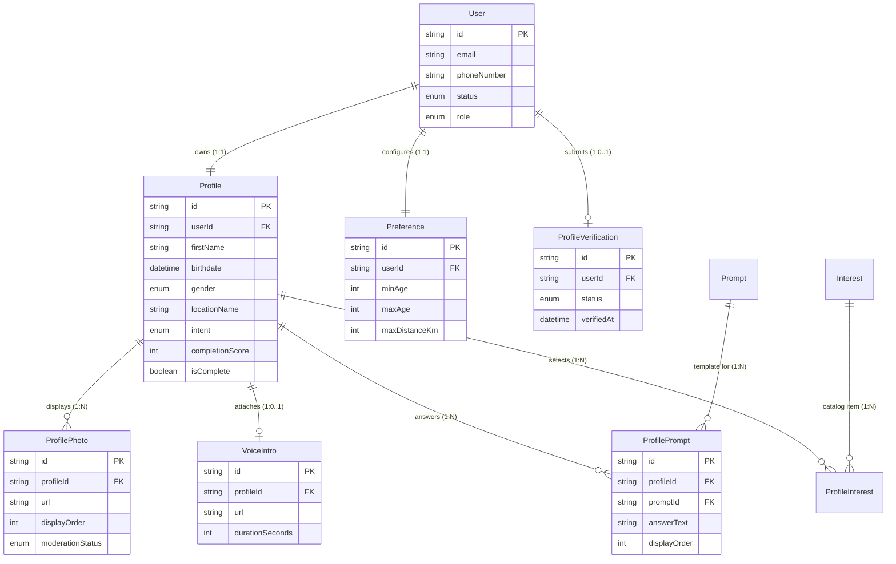
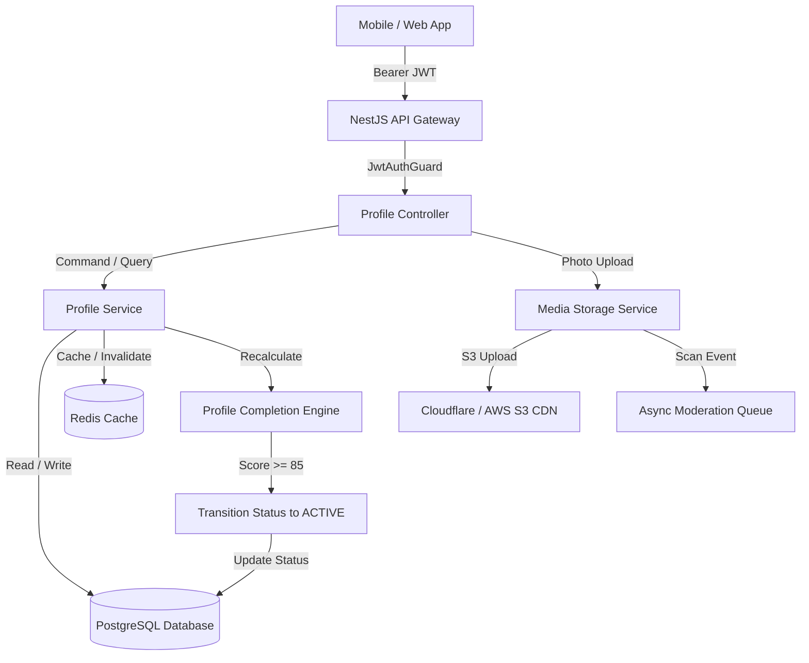

# Profile Domain Architecture Design

**Document Version:** 1.0.0  
**Status:** APPROVED ARCHITECTURE SPECIFICATION  
**Author:** DeepMind Agentic Systems Architecture Team  
**Project:** Chapter One — Relationship-First Dating Platform  

---

## Executive Summary

This document specifies the architecture for the **Profile Domain** within Chapter One. The Profile domain manages user identity presentation, personal attributes, expressional prompts, photos, voice intros, interests, and discovery preferences. It acts as the foundational data source for onboarding, matching algorithms, discovery feeds, chat presentation, and safety moderation.

---

## 1. Goals & Boundaries

### 1.1 Purpose of the Profile Domain
The Profile domain provides a rich, authentic representation of each member on Chapter One. Unlike traditional dating apps centered on superficial swiping, Chapter One emphasizes depth, personal narratives, and values. The Profile domain facilitates:
1. **Self-Expression:** Multi-modal storytelling through structured prompts, photos, voice intros, and lifestyle choices.
2. **Intentional Matchmaking:** High-signal data for algorithmic compatibility (intent, relationship goals, lifestyle values, interests).
3. **Safety & Trust:** Verification mechanisms and identity consistency checks.

### 1.2 Inter-Domain Boundary Interactions

```
                        ┌────────────────────────┐
                        │   Authentication Domain │
                        └───────────┬────────────┘
                                    │ (userId, Status)
                                    ▼
┌──────────────────┐    ┌────────────────────────┐    ┌──────────────────┐
│ Onboarding Domain├───►│     Profile Domain     │◄───┤ Discovery Domain │
└──────────────────┘    └───────────┬────────────┘    └──────────────────┘
                                    │
                  ┌─────────────────┼─────────────────┐
                  ▼                 ▼                 ▼
          ┌──────────────┐  ┌──────────────┐  ┌──────────────┐
          │ Matching App │  │ Chat Service │  │ Moderation   │
          └──────────────┘  └──────────────┘  └──────────────┘
```

- **Authentication Domain:** Maintains strict separation. Auth owns security credentials (passwords, JWTs, refresh tokens, phone verification codes). Profile references `userId` as an immutable foreign key. Profile never stores credentials.
- **Onboarding Domain:** Guides users step-by-step through profile population. Onboarding updates Profile entities and transitions `user.status` from `PENDING_ONBOARDING` to `ACTIVE` once mandatory profile completion criteria are met.
- **Discovery & Search Domain:** Reads Profile and `Preference` data to construct spatial geospatial queries, demographic filters, and candidate pools.
- **Matching & Compatibility Domain:** Analyzes Profile prompts, interests, relationship goals, and lifestyle choices to calculate multi-dimensional compatibility scores.
- **Chat Domain:** Displays profile snippets (first name, main photo, voice intro preview) during active introduction stages.
- **Moderation & Safety Domain:** Inspects profile media (photos, voice intros, prompt text) against safety models and user reports.

---

## 2. Domain Model & Entities

The Profile domain consists of 9 core entities:

### 2.1 Core Entities Breakdown

1. **User (Auth Boundary Reference)**
   - System actor identity created by the Auth domain. Owns global status (`UNVERIFIED`, `PENDING_ONBOARDING`, `ACTIVE`, `SUSPENDED`, `DEACTIVATED`) and role (`USER`, `ADMIN`).
2. **Profile (Root Aggregate)**
   - Core profile entity containing primary biographical details: first name, birthdate (age derived dynamically), gender, height, occupation, company, education, location, bio summary, relationship goals, and lifestyle attributes.
3. **ProfilePhoto**
   - Ordered photo gallery items uploaded by the user. Contains media URL, display order index, processing status, and moderation audit flags.
4. **VoiceIntro**
   - Optional 30-second audio recording providing an authentic voice sample. Stores audio stream URL, duration in seconds, waveform data, and processing status.
5. **Interest (Global Reference Catalog)**
   - System-curated library of interests and hobbies categorized by domain (e.g., "Outdoors", "Arts & Culture", "Tech", "Culinary").
6. **ProfileInterest (Junction Table)**
   - Many-to-many join entity associating a user's `Profile` with selected system `Interest` records.
7. **Prompt (System Catalog)**
   - Curated icebreaker questions/prompts designed to reveal values and personality (e.g., "The key to my heart is...", "A non-negotiable for me...").
8. **ProfilePrompt (User Answers)**
   - User's response to a specific system `Prompt`. Stores the response text (or optional voice response URL) and display ordering.
9. **Preference (Discovery & Matching Criteria)**
   - Discovery filters and match criteria owned by the user (target age range, maximum search distance, preferred genders, dealbreakers, intent filters).
10. **ProfileVerification (Trust & Identity Verification)**
    - Stores selfie verification status, badge issue date, verification method (e.g. 3D Liveness Selfie), and audit metadata.

---

## 3. Entity Responsibilities & Data Segregation

To maintain clean architectural boundaries and prevent data duplication:

| Entity | Primary Responsibility | Data Belonging to Entity |
|---|---|---|
| `User` | Credential & Security Context | Email, Phone Number, Password Hash, Account Status, Role, Verification Timestamps. |
| `Profile` | Personal Narrative & Attributes | First Name, Birthdate, Gender, Pronouns, Location (City/State), Height (cm), Occupation, Education, Relationship Intent, Lifestyle (Drinking, Smoking, Exercise, Children, Religion). |
| `ProfilePhoto` | Visual Gallery Assets | Image CDN URL, Aspect Ratio, Display Order Index, Moderation Status (`PENDING`, `APPROVED`, `REJECTED`). |
| `VoiceIntro` | Audio Self-Expression | Audio Stream URL, Recording Duration (sec), Waveform Peak Array (JSON), Moderation Status. |
| `Interest` | Global Hobbies Catalog | Tag Name, Category Slug, Icon Asset Key. |
| `ProfileInterest` | Profile-Interest Linkage | `profileId`, `interestId`, Created Timestamp. |
| `Prompt` | Question Catalog | Prompt Text, Category ("Values", "Humor", "Relationship Goals"), Display Status. |
| `ProfilePrompt` | Answered Prompts | `profileId`, `promptId`, Answer Text (max 300 chars), Display Order Index. |
| `Preference` | Discovery Search Criteria | Min Age, Max Age, Max Distance (km), Desired Genders (array), Intent Filter, Lifestyle Dealbreakers. |
| `ProfileVerification` | Identity Trust Artifact | `userId`, Verification Status (`PENDING`, `VERIFIED`, `FAILED`), Liveness Score, Verified At Timestamp. |

---

## 4. Entity Relationships & Cardinality

### 4.1 Relationship Summary Matrix

- **`User` 1 ── 1 `Profile`**
  - *Type:* One-to-One (Strict)
  - *Reasoning:* A user account has exactly one public profile. `profile.userId` is a unique foreign key referencing `user.id` with `ON DELETE CASCADE`.
- **`User` 1 ── 1 `Preference`**
  - *Type:* One-to-One (Strict)
  - *Reasoning:* A user maintains one set of matching/discovery search criteria. Separated from `Profile` to allow independent updating during discovery browsing without invalidating profile cache.
- **`User` 1 ── 1 `ProfileVerification`**
  - *Type:* One-to-One (Optional)
  - *Reasoning:* A user may submit liveness verification to earn a verified trust badge.
- **`Profile` 1 ── N `ProfilePhoto`**
  - *Type:* One-to-Many
  - *Reasoning:* A profile contains a gallery of 1 to 6 photos ordered by index `(0..5)`.
- **`Profile` 1 ── 1 `VoiceIntro`**
  - *Type:* One-to-One (Optional)
  - *Reasoning:* A profile may optionally attach one 30-second audio voice intro.
- **`Profile` N ── M `Interest` (via `ProfileInterest`)**
  - *Type:* Many-to-Many
  - *Reasoning:* Users select multiple interests from a system catalog. Normalized via explicit junction table `ProfileInterest`.
- **`Profile` N ── M `Prompt` (via `ProfilePrompt`)**
  - *Type:* One-to-Many (per Profile-Prompt Response)
  - *Reasoning:* A profile answers between 1 and 3 system prompts, stored in `ProfilePrompt` with answer text and display order.

---

## 5. Prisma Schema Proposal

> **Note:** This is an architectural proposal document for review. Do **NOT** copy into `schema.prisma` directly until approved for implementation.

```prisma
// ==========================================
// PROPOSED PROFILE DOMAIN SCHEMA EXTENSION
// ==========================================

enum UserStatus {
  UNVERIFIED
  PENDING_ONBOARDING
  PENDING_VERIFICATION
  VERIFIED
  ACTIVE
  SUSPENDED
  DEACTIVATED
}

enum Gender {
  MALE
  FEMALE
  NON_BINARY
  OTHER
}

enum RelationshipIntent {
  LONG_TERM
  LONG_TERM_OPEN_TO_SHORT
  SHORT_TERM_OPEN_TO_LONG
  SHORT_TERM
  NEW_FRIENDS
  NOT_SURE_YET
}

enum LifestyleChoice {
  NEVER
  SOMETIMES
  FREQUENTLY
  PREFER_NOT_TO_SAY
}

enum VerificationStatus {
  NOT_SUBMITTED
  PENDING
  VERIFIED
  REJECTED
}

enum ModerationStatus {
  PENDING
  APPROVED
  FLAGGED
  REJECTED
}

// ------------------------------------------
// Profile Aggregate Root
// ------------------------------------------
model Profile {
  id                 String             @id @default(uuid())
  userId             String             @unique @map("user_id")
  user               User               @relation(fields: [userId], references: [id], onDelete: Cascade)
  
  firstName          String             @map("first_name")
  birthdate          DateTime           @map("birthdate")
  gender             Gender
  pronouns           String?
  heightCm           Int?               @map("height_cm")
  locationName       String             @map("location_name")
  latitude           Float?
  longitude          Float?
  occupation         String?
  company            String?
  education          String?
  bio                String?            @db.VarChar(500)
  intent             RelationshipIntent @default(NOT_SURE_YET)
  
  // Lifestyle Fields
  drinking           LifestyleChoice    @default(PREFER_NOT_TO_SAY)
  smoking            LifestyleChoice    @default(PREFER_NOT_TO_SAY)
  workout            LifestyleChoice    @default(PREFER_NOT_TO_SAY)
  hasChildren        Boolean?           @map("has_children")
  wantsChildren      Boolean?           @map("wants_children")
  religion           String?
  
  // Profile Completion Cache
  completionScore    Int                @default(0) @map("completion_score")
  isComplete         Boolean            @default(false) @map("is_complete")
  
  createdAt          DateTime           @default(now()) @map("created_at")
  updatedAt          DateTime           @updatedAt @map("updated_at")

  photos             ProfilePhoto[]
  voiceIntro         VoiceIntro?
  userInterests      ProfileInterest[]
  prompts            ProfilePrompt[]

  @@map("profiles")
  @@index([latitude, longitude])
  @@index([gender, intent])
}

// ------------------------------------------
// Photos Gallery
// ------------------------------------------
model ProfilePhoto {
  id               String           @id @default(uuid())
  profileId        String           @map("profile_id")
  profile          Profile          @relation(fields: [profileId], references: [id], onDelete: Cascade)
  
  url              String
  thumbnailUrl     String?          @map("thumbnail_url")
  displayOrder     Int              @default(0) @map("display_order")
  moderationStatus ModerationStatus @default(PENDING) @map("moderation_status")
  blurHash         String?          @map("blur_hash")
  
  createdAt        DateTime         @default(now()) @map("created_at")
  updatedAt        DateTime         @updatedAt @map("updated_at")

  @@map("profile_photos")
  @@unique([profileId, displayOrder])
  @@index([profileId])
}

// ------------------------------------------
// Voice Intro Media
// ------------------------------------------
model VoiceIntro {
  id               String           @id @default(uuid())
  profileId        String           @unique @map("profile_id")
  profile          Profile          @relation(fields: [profileId], references: [id], onDelete: Cascade)
  
  url              String
  durationSeconds  Int              @map("duration_seconds")
  waveform         Json?            // Array of amplitude peaks for UI playback
  moderationStatus ModerationStatus @default(PENDING) @map("moderation_status")
  
  createdAt        DateTime         @default(now()) @map("created_at")
  updatedAt        DateTime         @updatedAt @map("updated_at")

  @@map("voice_intros")
}

// ------------------------------------------
// Interests Catalog & Junction Table
// ------------------------------------------
model Interest {
  id            String            @id @default(uuid())
  name          String            @unique
  category      String            // e.g. "Outdoors", "Tech", "Arts"
  iconKey       String?           @map("icon_key")
  
  userInterests ProfileInterest[]

  @@map("interests")
  @@index([category])
}

model ProfileInterest {
  id         String   @id @default(uuid())
  profileId  String   @map("profile_id")
  profile    Profile  @relation(fields: [profileId], references: [id], onDelete: Cascade)
  interestId String   @map("interest_id")
  interest   Interest @relation(fields: [interestId], references: [id], onDelete: Cascade)
  
  createdAt  DateTime @default(now()) @map("created_at")

  @@unique([profileId, interestId])
  @@map("user_interests")
}

// ------------------------------------------
// Prompts Catalog & Responses
// ------------------------------------------
model Prompt {
  id           String          @id @default(uuid())
  text         String          @unique
  category     String          @default("General")
  isActive     Boolean         @default(true) @map("is_active")
  
  userPrompts  ProfilePrompt[]

  @@map("prompts")
}

model ProfilePrompt {
  id           String   @id @default(uuid())
  profileId    String   @map("profile_id")
  profile      Profile  @relation(fields: [profileId], references: [id], onDelete: Cascade)
  promptId     String   @map("promptId")
  prompt       Prompt   @relation(fields: [promptId], references: [id], onDelete: Cascade)
  
  answerText   String   @db.VarChar(300) @map("answer_text")
  displayOrder Int      @default(0) @map("display_order")
  
  createdAt    DateTime @default(now()) @map("created_at")
  updatedAt    DateTime @updatedAt @map("updated_at")

  @@unique([profileId, promptId])
  @@unique([profileId, displayOrder])
  @@map("profile_prompts")
}

// ------------------------------------------
// Discovery Preferences
// ------------------------------------------
model Preference {
  id                 String               @id @default(uuid())
  userId             String               @unique @map("user_id")
  user               User                 @relation(fields: [userId], references: [id], onDelete: Cascade)
  
  minAge             Int                  @default(18) @map("min_age")
  maxAge             Int                  @default(99) @map("max_age")
  maxDistanceKm      Int                  @default(50) @map("max_distance_km")
  preferredGenders   Gender[]             @map("preferred_genders")
  preferredIntents   RelationshipIntent[] @map("preferred_intents")
  
  createdAt          DateTime             @default(now()) @map("created_at")
  updatedAt          DateTime             @updatedAt @map("updated_at")

  @@map("preferences")
}

// ------------------------------------------
// Trust & Liveness Verification
// ------------------------------------------
model ProfileVerification {
  id               String             @id @default(uuid())
  userId           String             @unique @map("user_id")
  user             User               @relation(fields: [userId], references: [id], onDelete: Cascade)
  
  status           VerificationStatus @default(NOT_SUBMITTED)
  livenessScore    Float?             @map("liveness_score")
  rejectionReason  String?            @map("rejection_reason")
  verifiedAt       DateTime?          @map("verified_at")
  
  createdAt        DateTime           @default(now()) @map("created_at")
  updatedAt        DateTime           @updatedAt @map("updated_at")

  @@map("profile_verifications")
}
```

---

## 6. Validation Rules & Field Specifications

### 6.1 Profile Entity Validation

| Field | Type | Required / Optional | Limits & Format | Edit Rules |
|---|---|---|---|---|
| `firstName` | `string` | **Required** | Min 2, Max 30 chars. Alpha, spaces, hyphens. | Editable (Max 1 change per 30 days to prevent deception). |
| `birthdate` | `DateTime` | **Required** | Must yield Age >= 18 and <= 100 years. | Immutable after initial onboarding (requires Support override). |
| `gender` | `Enum` | **Required** | Enum: `MALE`, `FEMALE`, `NON_BINARY`, `OTHER`. | Editable. |
| `pronouns` | `string` | Optional | Max 20 chars (e.g. "she/her"). | Editable anytime. |
| `heightCm` | `integer` | Optional | Range: 90 cm to 230 cm (approx 3'0" to 7'6"). | Editable. |
| `locationName` | `string` | **Required** | City, Country string (Max 100 chars). | Auto-updated via GPS / IP or manual edit. |
| `latitude` / `longitude` | `float` | Optional | Valid WGS84 coordinates (`lat`: -90..90, `lng`: -180..180). | System updated. |
| `occupation` | `string` | Optional | Max 50 chars. | Editable anytime. |
| `company` | `string` | Optional | Max 50 chars. | Editable anytime. |
| `education` | `string` | Optional | Max 50 chars (e.g. "BS Computer Science, Stanford"). | Editable anytime. |
| `bio` | `string` | Optional | Max 500 chars. Sanitized HTML/Script tags. | Editable anytime. |
| `intent` | `Enum` | **Required** | Enum: `LONG_TERM`, `SHORT_TERM`, `NEW_FRIENDS`, etc. | Editable anytime. |

### 6.2 Media Assets Validation

- **`ProfilePhoto` Gallery Rules:**
  - Minimum mandatory: **2 photos** required for profile activation.
  - Maximum allowed: **6 photos**.
  - Formats: JPEG, PNG, WebP. Max upload file size: 10 MB per image.
  - Dimensions: Minimum 600x800 pixels (aspect ratio ~ 3:4).
  - Moderation: Must pass automated adult content detection before public display.
- **`VoiceIntro` Rules:**
  - Maximum 1 active recording per profile.
  - Format: AAC / MP4 / OGG audio stream.
  - Duration: Minimum 5 seconds, Maximum 30 seconds.
- **`ProfilePrompt` Rules:**
  - Minimum 1 prompt required for onboarding completion; maximum 3 prompts.
  - Answer length: Minimum 5 chars, Maximum 300 chars per prompt.
- **`ProfileInterest` Rules:**
  - Minimum 3 interests required; maximum 10 interests per profile.

---

## 7. Profile Completion Calculation Engine

Instead of storing a fragile boolean that quickly desynchronizes, Chapter One uses a **Dynamic Weighted Profile Completion Score Algorithm** calculated by `ProfileCompletionEngine`.

### 7.1 Completion Weight Distribution (Total: 100 Points)

```
┌─────────────────────────────────────────────────────────────┐
│              PROFILE COMPLETION WEIGHT MATRIX               │
├───────────────────────────────┬────────────┬────────────────┤
│ Component                     │ Weight     │ Requirement    │
├───────────────────────────────┼────────────┼────────────────┤
│ Basic Attributes (Name/Age)   │ 20 Points  │ Mandatory (20) │
│ Primary Photo                 │ 20 Points  │ Mandatory (20) │
│ Secondary Photo               │ 15 Points  │ Mandatory (15) │
│ Relationship Intent           │ 15 Points  │ Mandatory (15) │
│ Minimum 3 Interests           │ 10 Points  │ Mandatory (10) │
│ Minimum 1 Prompt Answer       │ 10 Points  │ Mandatory (10) │
│ Bio Text (>20 chars)          │  5 Points  │ Optional  (5)  │
│ Voice Intro Recording         │  5 Points  │ Optional  (5)  │
└───────────────────────────────┴────────────┴────────────────┘
```

### 7.2 Onboarding Threshold & Status Transition
- **Mandatory Completion Threshold:** **85 Points** (Includes all mandatory items: Basics + 2 Photos + Intent + 3 Interests + 1 Prompt).
- **Completion Formula:**
  $$\text{CompletionScore} = \sum_{i=1}^{n} \text{Weight}_i \times \text{IsSatisfied}_i$$
- **State Transition Rule:**
  $$\text{If } \text{CompletionScore} \ge 85 \text{ AND } \text{user.status} == \text{'PENDING\_ONBOARDING'} \implies \text{user.status} \gets \text{'ACTIVE'}$$

The score is cached in `profile.completionScore` and `profile.isComplete` for performant SQL indexing, but recomputed automatically upon any profile mutation event via Domain Event Listeners (`ProfileUpdatedEvent`).

---

## 8. Future Extensibility Architecture

The proposed Profile domain architecture is explicitly designed for seamless integration with upcoming roadmap features without requiring breaking schema migrations:

1. **Premium Tier Highlights (`Profile`):**
   - Extensible by adding a `isBoosted`, `spotlightUntil`, or `superLikesCount` attribute or linking to a dedicated `Subscription` domain model via `userId`.
2. **Identity & Liveness Verification Badges (`ProfileVerification`):**
   - Isolated in `ProfileVerification` entity. When `status == 'VERIFIED'`, the discovery and chat services render a verified checkmark badge on the profile.
3. **AI Profile Summaries & Prompts:**
   - AI-generated bio suggestions or prompt polishing can store transient drafts in Redis and commit finalized answers directly to `profile.bio` or `ProfilePrompt.answerText`.
4. **Algorithmic Compatibility Scoring:**
   - The separation of `Profile` attributes, `ProfileInterest`, `ProfilePrompt`, and `Preference` allows vector embedding engines (e.g. OpenAI Embeddings + PgVector) to generate a 1536-dimensional profile embedding vector for instant vector similarity matching.
5. **Safety Moderation & Reporting:**
   - Moderation flags (`moderationStatus`) on `ProfilePhoto` and `VoiceIntro` enable asynchronous background AI scanning (e.g. AWS Rekognition / Google Vision API) without blocking user uploads.
6. **Soft Deletion & Privacy Compliance (GDPR/CCPA):**
   - User account deletion triggers an `ON DELETE CASCADE` across `Profile`, `ProfilePhoto`, `VoiceIntro`, `ProfilePrompt`, `ProfileInterest`, and `Preference`, ensuring complete erasure of personal data.

---

## 9. API Surface Specification (Proposed REST Endpoints)

The following endpoints will form the REST API contract for the Profile module (all endpoints require `JwtAuthGuard` and Bearer JWT authentication):

```
GET    /api/v1/profile/me             Fetch full profile & preferences for current user
PATCH  /api/v1/profile/me             Update biographical & lifestyle profile fields
GET    /api/v1/profile/completion     Get detailed profile completion breakdown & score

POST   /api/v1/profile/photos         Upload a new profile photo (multipart/form-data)
DELETE /api/v1/profile/photos/:id     Delete a profile photo
PUT    /api/v1/profile/photos/reorder Reorder profile photos array

POST   /api/v1/profile/voice-intro    Upload / replace 30-second voice intro recording
DELETE /api/v1/profile/voice-intro   Remove voice intro recording

GET    /api/v1/profile/prompts        List all active system prompts
PUT    /api/v1/profile/prompts        Upsert user prompt responses (max 3)

GET    /api/v1/profile/interests      List system interests catalog by category
PUT    /api/v1/profile/interests      Update selected user interest IDs (min 3, max 10)

GET    /api/v1/profile/preferences    Get discovery search preferences
PATCH  /api/v1/profile/preferences    Update discovery search preferences (age, distance, gender)

GET    /api/v1/profile/:userId        Fetch public view of another member's profile (for discovery/chat)
```

---

## 10. Mermaid Architecture & Entity Diagrams

### 10.1 Entity Relationship Diagram (ERD)



### 10.2 Domain Data & Control Flow Diagram



---

## 11. Design Decisions & Tradeoffs

### Decision 1: Separation of `User` (Auth) and `Profile` (Presentation)
- **Choice:** Keep credentials and system state in `User`, while placing personal storytelling attributes in `Profile`.
- **Tradeoff:** Requires a 1-to-1 database join when assembling user sessions with profile metadata.
- **Justification:** Essential for security and modularity. Auth domain can evolve independently (e.g. adding OAuth, WebAuthn) without touching profile logic. Prevents accidental leakage of `passwordHash` or sensitive auth data in public profile queries.

### Decision 2: Dynamic Completion Engine with Cached Aggregate Score
- **Choice:** Calculate completion score via weighted criteria, caching `completionScore` and `isComplete` on the `Profile` model.
- **Tradeoff:** Requires invalidating or updating the cached score on any photo, prompt, or profile edit.
- **Justification:** Avoids recalculating complex profile completion rules on every discovery feed query while ensuring the database index `@@index([is_complete])` can instantly filter active, complete profiles for matching algorithms.

### Decision 3: Separate `Preference` Entity for Discovery Settings
- **Choice:** Store search filters (age, distance, target genders) in a dedicated `Preference` entity rather than inside `Profile`.
- **Tradeoff:** Requires an extra database table.
- **Justification:** Discovery preferences are updated frequently while browsing matches. Keeping preferences separate prevents frequent write locks on the main `Profile` entity and allows caching candidate profiles independently of the viewing user's search criteria.

### Decision 4: System-Curated Catalogs for `Interest` and `Prompt`
- **Choice:** User interests and prompts reference system-managed catalogs (`Interest` and `Prompt`) rather than free-form tags.
- **Tradeoff:** Users cannot create custom interest tags or custom prompt questions.
- **Justification:** High-quality matching algorithms require standardized categories and interest embeddings. Free-form text tags lead to misspellings, duplication, and poor match scoring.

---

## 12. Verification & Next Steps

This document completes the architectural specification for the **Profile Domain**. 

- [x] Goals & domain boundaries defined
- [x] Domain entities & responsibilities established
- [x] Entity relationships & cardinality documented
- [x] Proposed Prisma schema produced
- [x] Validation rules specified
- [x] Profile completion calculation engine designed
- [x] Future extensibility analyzed
- [x] REST API surface proposed
- [x] Mermaid ERD and Architecture diagrams included
- [x] Design decisions & tradeoffs justified

No source code or schema files were modified during this architecture task. Implementation of the Profile domain will proceed in subsequent roadmap phases based on this specification.
